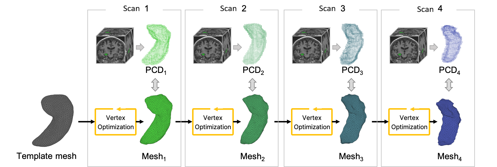

```md
# Brain Subcortical Structure Modeling and Analysis Codes

Brain Subcortical Structure Mesh Reconstruction from Template Meshes for Cross-sectional and Longitudinal Analysis.

This repository includes:
- A shape reconstruction framework based on template meshes for cross-sectional and longitudinal shape modeling.
- Statistical shape analysis methods for cross-sectional and longitudinal studies using linear regression, ANCOVA, and linear mixed-effects models.

## Publications

This is the official implementation for the following papers:

- **"Subcortical Shape Variations and Their Associations with Cognition Across the 8th Decade of Life: A Study in the Lothian Birth Cohort 1936"**,  
  M. Hernandez, W. Park, et al.  
  All data are available through the `Edinburgh Database`.

- **"AI-based Deformable Hippocampal Mesh Reflects Hippocampal Morphological Characteristics in Relation to Cognition in Healthy Older Adults"**,  
  W. Park, M. Hernandez, et al.  
  *NeuroImage* (2025).  
  DOI: 10.1016/j.neuroimage.2025.121145

---

## Overview

This repository provides the complete pipeline for subcortical structure reconstruction from template meshes.

The repository includes:
1. Generation of template meshes.
2. Optimization of individual subcortical structures from template meshes using a PointNet-based deep learning framework.
3. Extraction of local deformities from template meshes.
4. Shape-to-clinical factor association analysis provided in the `analysis_code` folder.

Template meshes are provided in `whole_brain_structure/temp_meshes` as shown below.

<p align="center">

</p>

---

## Overall Pipeline

The overall pipeline is illustrated below.


---

## Longitudinal Shape Modeling

The longitudinal shape modeling framework is illustrated below.


```
